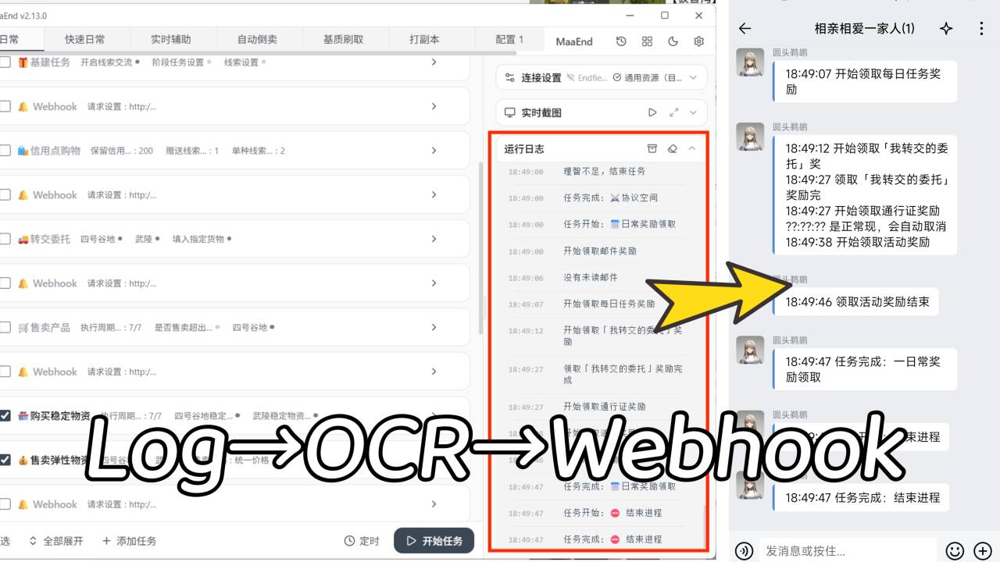

<p align="center">
  
</p>

<p align="center">
  <a href="README.md">简体中文</a> | English
</p>

# MaaEnd OCR Webhook Service

MaaEnd OCR Webhook Service is a Windows command line tool that watches a target application window, reads MaaEnd-style runtime logs through OCR, and forwards detected log lines to a Webhook endpoint. It is designed for workflows where logs are visible in a GUI window but still need to be collected, buffered, and forwarded to external services.

This program was created because the official MaaEnd repository has limited Webhook push support, currently relying on HTTP POST that is only usable on a small number of platforms, and there is no short-term development plan for broader notification support. See [MaaEnd issue #1421](https://github.com/MaaEnd/MaaEnd/issues/1421).

Compared with [MaaEnd-Webhook-Retransmitter](https://github.com/SHthemW/MaaEnd-Webhook-Retransmitter), this OCR-based pusher can capture more information and offers more flexibility, so this repository will be the primary maintained implementation going forward.

## Features

- Finds the target window by title, with exact or partial matching.
- Uses OCR to locate a configured anchor text, then reads log lines below it.
- Supports realtime pushes, summary pushes on exit, or both.
- Supports Webhook body templates with `__CONTENT__` as the log text placeholder and optional `__TIME__` as the log time placeholder.
- Opens Notepad for multi-line Webhook body editing during interactive setup.
- Supports realtime push caching to reduce frequent Webhook requests.
- Keeps critical logs as standalone pushes. Logs containing `任务` or `重要通知` flush pending cached logs first, then push the critical log separately.
- Can save screenshots and OCR preprocessing images for troubleshooting.

## Quick Start

1. Download and extract the release package.
2. Run `MaaEnd-Log-Retransmitter.exe`.
3. On first launch, you usually only need to fill in two Webhook fields:
   - `WebhookUrl`
   - `WebhookBody`
4. After saving, the program starts reading MaaEnd logs and pushing them.
5. Press `Ctrl+C` to stop rolling recognition. Pending cached pushes are flushed before exit.

The release package includes a default `config.json`. By default, it looks for a window whose title contains `MaaEnd`, then starts OCR below `运行日志`. On later launches, the program checks the configuration automatically. If it is complete and valid, it starts immediately without confirmation.

## First-Time Setup

The default configuration covers most MaaEnd use cases. For first-time use, focus on these two fields:

- `WebhookUrl`: HTTP/HTTPS endpoint that receives log pushes.
- `WebhookBody`: request body template. It must contain `__CONTENT__` and can optionally contain `__TIME__`.

Webhook bodies are often multi-line JSON. When configuring this field, the program opens `webhook-body-template.json` in Notepad. Edit the template, save it, close Notepad, and the CLI will continue.

Example body:

```json
{
  "time": "__TIME__",
  "content": "__CONTENT__"
}
```

If you use WeCom, Discord, Slack, or another Webhook service, these two fields are usually the only required changes.

## Default Behavior

- Target window: a window whose title contains `MaaEnd`, such as `MaaEnd v2.13.0`.
- Anchor text: `运行日志`.
- Push mode: `Realtime`; new logs are pushed as they are detected.
- OCR language: `zh-Hans`.
- Push cache: disabled by default.
- Screenshot saving: disabled by default.

## Common Options

- Window title: the title of the target application window.
- Search text: anchor text used to locate the log area.
- Match mode: the program prefers exact title matches; short input such as `MaaEnd` can also match a full title like `MaaEnd v2.13.0`.
- Webhook mode: realtime push, summary push, or both.
- Webhook push cache time: seconds. `0` disables caching.
- Save screenshots: only enable this when troubleshooting OCR or screenshot issues.

## Full Configuration Reference

`config.json` is located next to the executable and uses standard JSON. Important fields:

| Field | Meaning | Valid value |
| --- | --- | --- |
| `WindowTitle` | Target window title | Non-empty string |
| `SearchText` | Anchor text; rolling OCR starts below it | Non-empty string |
| `PartialMatch` | Force partial window title matching; even when `false`, short titles can still fall back to containment matching | `true` / `false` |
| `SaveScreenshot` | Save screenshots and OCR preprocessing images | `true` / `false` |
| `Retry` | Initial OCR retry count | `1` to `10` |
| `RetryInterval` | Initial OCR retry interval in milliseconds | `100` to `60000` |
| `RollingIntervalMs` | Rolling OCR interval in milliseconds | `500` to `60000` |
| `CaseSensitive` | Match `SearchText` case-sensitively | `true` / `false` |
| `Language` | Windows OCR language tag | For example `zh-Hans` |
| `WebhookUrl` | Webhook endpoint | Non-empty `http` / `https` URL |
| `WebhookBody` | Webhook request body template | Non-empty, must contain `__CONTENT__`, and can optionally contain `__TIME__` |
| `WebhookContentType` | Webhook request Content-Type | Non-empty string, commonly `application/json` |
| `WebhookTimeoutMs` | Webhook request timeout in milliseconds | `1000` to `60000` |
| `WebhookMode` | Webhook push mode | `Realtime` / `Summary` / `All` |
| `WebhookPushCacheSeconds` | Realtime push cache time in seconds | `0` to `86400`; `0` disables caching |

## Webhook Modes

- `Realtime`: push each new log line during rolling recognition.
- `Summary`: push collected logs when the program stops.
- `All`: enable both realtime and summary pushes.

When sending a Webhook, `__CONTENT__` is replaced with the log text only and no longer includes the time. If the template contains `__TIME__`, it is replaced with the recognized time string.

When `WebhookPushCacheSeconds` is greater than `0`, normal realtime logs are buffered. Once the configured number of seconds has elapsed, cached logs are merged into one Webhook push.

Critical logs are never merged into the cache. When a log contains `任务` or `重要通知`, the program first sends and clears the existing cache, then sends that critical log as a separate Webhook push.

## Usage Tips

- Choose `SearchText` from stable text that appears above the log area.
- `WindowTitle` can be a full title or a stable short title such as `MaaEnd`.
- If OCR cannot find the anchor text, enable `SaveScreenshot` and inspect the saved screenshots and preprocessing images.
- If the Webhook platform expects JSON, set `WebhookContentType` to `application/json` and make sure `WebhookBody` is valid JSON.
- If pushes are too frequent, set `WebhookPushCacheSeconds`, such as `10` or `30`.

## Troubleshooting

- Window not found: check `WindowTitle` and `PartialMatch`.
- `SearchText` not found: check screenshots, OCR language, and case-sensitive matching.
- Screenshot looks wrong: make sure the target window is visible and not minimized.
- Webhook push failed: check `WebhookUrl`, `WebhookBody`, `WebhookContentType`, and `WebhookTimeoutMs`.
- OCR language unavailable: install the corresponding Windows OCR language package.

## Development And Packaging

Development build:

```powershell
dotnet build
```

Release package:

```powershell
dotnet publish -c Release
```

The project is configured for Windows x64 self-contained single-file publishing. Output files are written to `publish\`:

```text
publish\MaaEnd-Log-Retransmitter.exe
publish\MaaEnd-Log-Retransmitter.pdb
```

<p align="center">
  
</p>

<p align="center">
  
</p>
